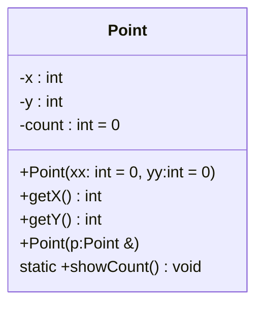

```mermaid
classDiagram
class Point {
    -x : int
    -y : int
    -count : int = 0
    +Point(xx: int = 0, yy:int = 0)
    +getX() int
    +getY() int
    +Point(p:Point &)
    static +showCount() void
}
```
