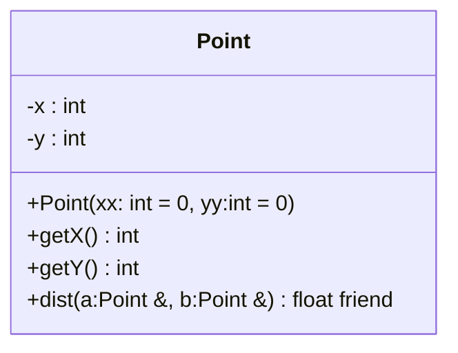

```mermaid
classDiagram
class Point {
    -x : int
    -y : int

    +Point(xx: int = 0, yy:int = 0)
    +getX() int
    +getY() int

    +dist(a:Point &, b:Point &) float friend
}
```

Markdown Mermaid 无法正确输入 \<< static >> ++dist(a:Point &, b:Point &) : float
